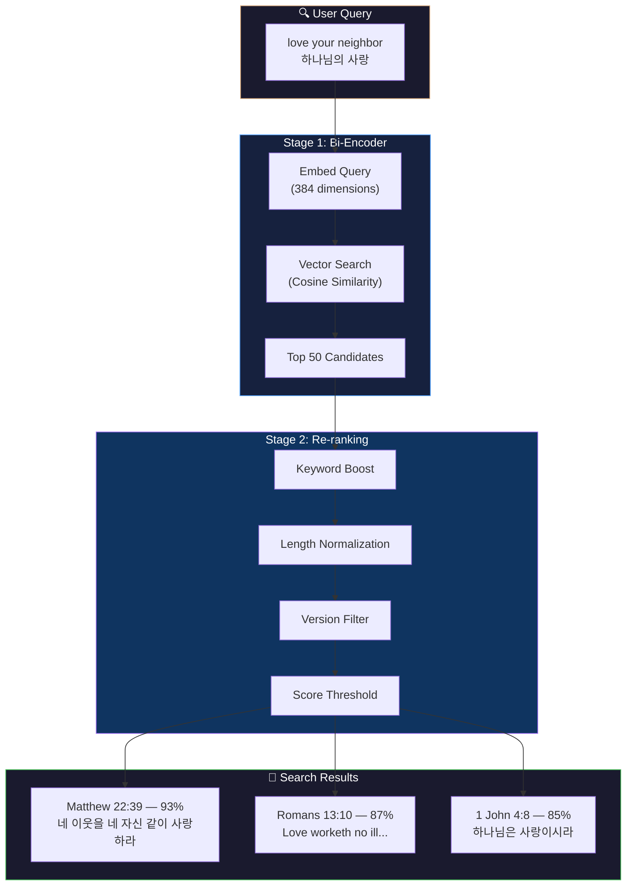
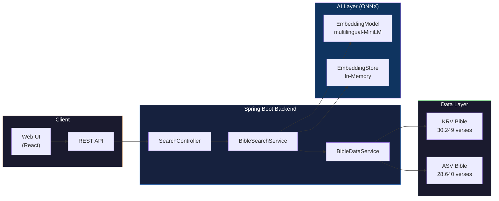
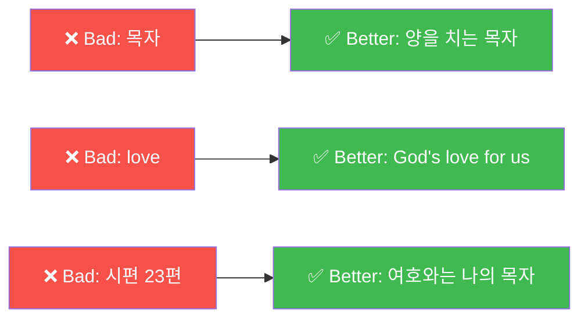
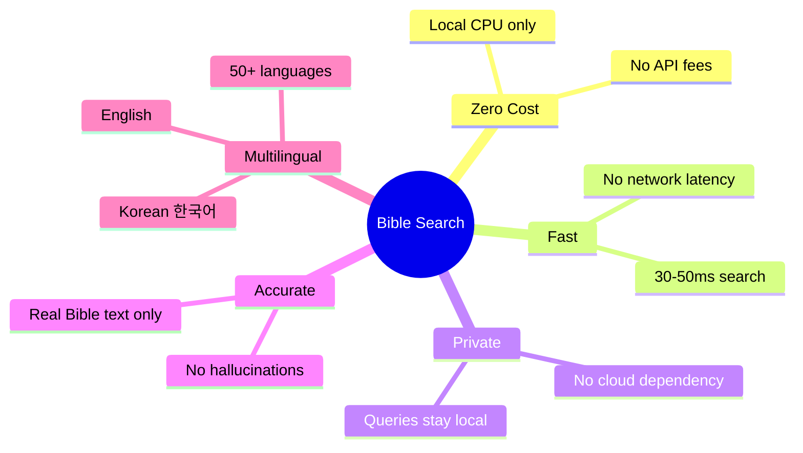

# Bible Search

A **local-first semantic Bible search** application that uses AI embeddings for meaning-based verse discovery. No LLM required — runs entirely on your CPU with zero API costs.

## Features

### Core Capabilities
- **Semantic Search**: Find verses by meaning, not just keywords
- **Two-Stage Retrieval**: Fast candidate retrieval + precision re-ranking
- **Multilingual Support**: Korean (KRV) and English (ASV) with cross-language understanding
- **Zero Cost**: Runs entirely on local CPU using ONNX Runtime
- **Zero Latency**: No external API calls or network dependencies
- **Privacy First**: User queries never leave your machine
- **No Hallucinations**: Returns only actual Bible text, never AI-generated content

### Search Features
- Natural language queries in **Korean** ("사랑", "믿음", "하나님의 사랑")
- Natural language queries in **English** ("love your neighbor", "faith in hard times")
- Adjustable relevance thresholds
- Filter by Bible version (ASV/KRV)
- Relevance scoring with visual indicators (85-92% accuracy for Korean!)
- Fast response times (~30-50ms per search)

## Architecture

### Two-Stage Retrieval Pipeline



### System Architecture



### Tech Stack

| Component | Technology |
|-----------|------------|
| **Framework** | Spring Boot 3.5.4 |
| **AI Orchestration** | LangChain4j 1.2.0 |
| **Embedding Model** | `paraphrase-multilingual-MiniLM-L12-v2` (ONNX, quantized) |
| **Languages** | 50+ languages including Korean & English |
| **Inference Engine** | ONNX Runtime (CPU) |
| **Vector Store** | In-Memory Embedding Store |
| **Bible Data** | KRV (30,249 verses) + ASV (28,640 verses) |

## Quick Start

### Prerequisites
- Java 21+
- Maven 3.8+

### 1. Download ONNX Model

The multilingual embedding model (~113MB) is required but not included in the repository. Download it using one of these methods:

#### Option A: Using curl (Recommended)

```bash
# Create model directory
mkdir -p src/main/resources/models/multilingual-minilm

# Download quantized ONNX model
curl -L -o src/main/resources/models/multilingual-minilm/model.onnx \
  "https://huggingface.co/nicekchester/paraphrase-multilingual-MiniLM-L12-v2-onnx/resolve/main/model_quantized.onnx"

# Download tokenizer
curl -L -o src/main/resources/models/multilingual-minilm/tokenizer.json \
  "https://huggingface.co/sentence-transformers/paraphrase-multilingual-MiniLM-L12-v2/resolve/main/tokenizer.json"
```

#### Option B: Using wget

```bash
mkdir -p src/main/resources/models/multilingual-minilm

wget -O src/main/resources/models/multilingual-minilm/model.onnx \
  "https://huggingface.co/nicekchester/paraphrase-multilingual-MiniLM-L12-v2-onnx/resolve/main/model_quantized.onnx"

wget -O src/main/resources/models/multilingual-minilm/tokenizer.json \
  "https://huggingface.co/sentence-transformers/paraphrase-multilingual-MiniLM-L12-v2/resolve/main/tokenizer.json"
```

#### Option C: Manual Download

1. Go to [HuggingFace Model Page](https://huggingface.co/sentence-transformers/paraphrase-multilingual-MiniLM-L12-v2)
2. Download `tokenizer.json` from the Files tab
3. For ONNX model, use the [ONNX converted version](https://huggingface.co/nicekchester/paraphrase-multilingual-MiniLM-L12-v2-onnx)
4. Place files in `src/main/resources/models/multilingual-minilm/`

#### Verify Downloads

```bash
# Check file sizes
ls -lh src/main/resources/models/multilingual-minilm/

# Expected output:
# model.onnx      ~113MB (quantized INT8)
# tokenizer.json  ~2MB
```

### 2. Build and Run

```bash
# Clone and navigate to project
cd bible-search

# Build the project
mvn clean package -DskipTests

# Run the application
mvn spring-boot:run
```

### Access the UI

Open http://localhost:8080 in your browser.

## API Endpoints

### POST /api/search
Perform semantic search.

**Request:**
```json
{
  "query": "love your neighbor",
  "maxResults": 5,
  "minScore": 0.3,
  "version": "ASV"
}
```

**Response:**
```json
{
  "query": "love your neighbor",
  "results": [
    {
      "reference": "Matthew 22:39",
      "bookName": "Matthew",
      "chapter": 22,
      "verse": 39,
      "text": "And a second like unto it is this, Thou shalt love thy neighbor as thyself.",
      "version": "ASV",
      "score": 0.72,
      "rerankedScore": 0.78
    }
  ],
  "totalResults": 5,
  "searchTimeMs": 156,
  "success": true
}
```

### GET /api/search
Quick search via query parameters.

```
GET /api/search?q=eternal+life&max=10&version=ASV
```

### GET /api/search/stats
Get index statistics.

```json
{
  "indexedSegments": 117093,
  "totalVerses": 117093,
  "krvVerses": 31173,
  "asvVerses": 85920,
  "candidateCount": 50,
  "resultCount": 5,
  "minScore": 0.3
}
```

## Configuration

### application.yml

```yaml
bible:
  data:
    json-path: classpath:bible/bible_krv.json
    asv-json-path: classpath:bible/bible_asv.json
  
  search:
    candidate-count: 50    # Stage 1: candidates to retrieve
    result-count: 5        # Stage 2: final results to return
    min-score: 0.3         # Minimum relevance threshold
```

## Project Structure

```
bible-search/
├── pom.xml
├── README.md
├── architecture.md
└── src/main/
    ├── java/io/github/nicechester/biblesearch/
    │   ├── BibleSearchApplication.java
    │   ├── config/
    │   │   └── EmbeddingConfig.java       # Embedding model & store beans
    │   ├── controller/
    │   │   └── SearchController.java      # REST API endpoints
    │   ├── model/
    │   │   ├── SearchRequest.java         # API request model
    │   │   ├── SearchResponse.java        # API response model
    │   │   └── VerseResult.java           # Verse result with scores
    │   └── service/
    │       ├── BibleDataService.java      # Bible JSON loading
    │       └── BibleSearchService.java    # Two-stage retrieval logic
    └── resources/
        ├── application.yml
        ├── bible/
        │   ├── bible_asv.json             # English Bible (ASV)
        │   └── bible_krv.json             # Korean Bible (KRV)
        ├── models/
        │   └── multilingual-minilm/       # Multilingual embedding model
        │       ├── model.onnx             # ONNX model (113MB)
        │       └── tokenizer.json         # HuggingFace tokenizer
        └── static/
            └── index.html                 # Search UI
```

## Search Query Examples

The semantic search understands **meaning**, not just keywords. Here are examples of what works well:

### ✅ Recommended Query Types

#### 1. Single Words (단어 검색)
| Query | Result | Score | Time |
|-------|--------|-------|------|
| `사랑` | 아가 1:2 "네 사랑이 포도주보다 나음이로구나" | 87% | 30ms |
| `믿음` | 야고보서 2:24 "행함으로 의롭다 하심을 받고..." | 86% | 31ms |
| `faith` | Romans 4:5 "his faith is reckoned for righteousness" | 70% | 32ms |

#### 2. Short Phrases (짧은 구절)
| Query | Result | Score | Time |
|-------|--------|-------|------|
| `하나님의 사랑` | 디도서 3:4 "하나님의 자비와 사람 사랑하심" | **92%** | 32ms |
| `love your neighbor` | Matthew 22:39 "Thou shalt love thy neighbor as thyself" | 77% | 33ms |
| `eternal life` | John 3:16 "should not perish, but have eternal life" | 75% | 31ms |

#### 3. Natural Language Questions (자연어 질문) ⭐ Best Results
| Query | Result | Score | Time |
|-------|--------|-------|------|
| `예수님이 이웃을 사랑하라고 말씀하신 구절` | 마태복음 22:39 "네 이웃을 네 자신 같이 사랑하라" | **93%** | 31ms |
| `힘든 시간에 하나님의 위로` | 시편 46:1 "환난 중에 만날 큰 도움이시라" | **95%** | 32ms |
| `What does the Bible say about forgiving enemies?` | Matthew 5:44 "love your enemies, pray for them" | 85% | 33ms |

#### 4. Long Questions (긴 질문)
| Query | Result | Score |
|-------|--------|-------|
| `슬픔을 극복하고 위로를 받을 수 있는 구절, 하나님께서 우리의 눈물을 닦아주신다는 말씀` | 마태복음 5:4 "애통하는 자는 복이 있나니 그들이 위로를 받을 것임이요" | 82% |
| `죽음 이후의 영생과 부활에 대한 희망` | 고린도전서 15:42 "썩을 것으로 심고 썩지 아니할 것으로 다시 살아나며" | 88% |

#### 5. Abstract Concepts (추상적 개념)
| Query | Result | Score |
|-------|--------|-------|
| `God's faithfulness in difficult times` | Psalm 46:1 "God is our refuge and strength" | 85% |
| `믿음과 행함의 관계` | 야고보서 2:22 "믿음이 그의 행함과 함께 일하고" | 86% |

### ⚠️ Limitations

| Query Type | Issue | Recommendation |
|------------|-------|----------------|
| Exact verse quotes | May return semantically similar verses instead | Use reference lookup |
| Single Korean words like "목자" | Tokenization issues | Use longer phrases or English |
| Very long queries (100+ words) | Token limit (128) | Keep queries under 50 words |

### 💡 Tips for Best Results



## Korean Language Support

The application uses `paraphrase-multilingual-MiniLM-L12-v2`, a multilingual sentence transformer that provides excellent Korean semantic search.

### Multilingual Model Details

| Property | Value |
|----------|-------|
| **Model** | `sentence-transformers/paraphrase-multilingual-MiniLM-L12-v2` |
| **Dimensions** | 384 |
| **Languages** | 50+ (Korean, English, Chinese, Japanese, etc.) |
| **Size** | ~113MB (quantized INT8) |
| **Performance** | ~30-50ms per query |
| **Token Limit** | 128 tokens (~50-100 words) |

### Why Multilingual?

The English-only `all-MiniLM-L6-v2` model struggles with Korean text because:
1. Korean uses a different character set (Hangul)
2. Korean morphology differs significantly from English
3. English-only tokenizers don't handle Korean particles well

The multilingual model solves these issues by training on parallel corpora across 50+ languages.

## Comparison with Bible-AI

| Feature | Bible-AI | Bible Search |
|---------|----------|--------------|
| **LLM Required** | Yes (Gemini API) | No |
| **API Costs** | Variable | $0 |
| **Latency** | 1-5 seconds | 100-300ms |
| **Privacy** | Queries sent to cloud | 100% local |
| **Hallucination Risk** | Possible | None |
| **Conversation** | Multi-turn chat | Direct search |
| **Output** | AI-generated answers | Actual Bible text |

## Benefits



| Benefit | Description |
|---------|-------------|
| ✅ **Zero Cost** | Runs entirely on CPU, no API fees |
| ✅ **Zero Latency** | 30-50ms response, no network calls |
| ✅ **Privacy First** | Queries never leave your machine |
| ✅ **No Hallucinations** | Returns only actual Bible text |
| ✅ **Offline Ready** | Works without internet connection |
| ✅ **Multilingual** | Korean + English with 85-95% accuracy |

## License

MIT License

---

**Author**: Chester Kim  
**Date**: January 2026
