# Bible Search

A **local-first semantic Bible search** application that uses AI embeddings for meaning-based verse discovery. No LLM required — runs entirely on your CPU with zero API costs.

## Features

### Core Capabilities
- **Intelligent Search with Intent Detection**: Automatically chooses the best search method
- **Hybrid Search**: Combines keyword matching and semantic understanding
- **Two-Stage Retrieval**: Fast candidate retrieval + precision re-ranking
- **Multilingual Support**: Korean (KRV) and English (ASV) with cross-language understanding
- **Zero Cost**: Runs entirely on local CPU using ONNX Runtime
- **Zero Latency**: No external API calls or network dependencies
- **Privacy First**: User queries never leave your machine
- **No Hallucinations**: Returns only actual Bible text, never AI-generated content

### Search Features
- **🔤 Keyword Search**: Find exact word matches (e.g., `"가사"가 나오는 구절`)
- **🧠 Semantic Search**: Find verses by meaning (e.g., "comfort in suffering")
- **🔄 Hybrid Search**: Combines both methods for short queries
- Natural language queries in **Korean** ("사랑에 대한 말씀", "모세가 등장하는 구절")
- Natural language queries in **English** ("love your neighbor", "faith in hard times")
- Adjustable relevance thresholds
- Filter by Bible version (ASV/KRV)
- Relevance scoring with visual indicators (85-92% accuracy for Korean!)
- Fast response times (~30-50ms per search)

## Architecture

### Intelligent Intent Detection

The system automatically detects user intent and routes to the appropriate search method:

```mermaid
flowchart TD
    subgraph Input["🔍 User Query"]
        Q["User types a query"]
    end

    subgraph Detection["🎯 Intent Detection"]
        D{"Analyze Query<br/>Patterns"}
        K["🔤 KEYWORD<br/>Exact word match"]
        S["🧠 SEMANTIC<br/>Meaning-based"]
        H["🔄 HYBRID<br/>Both methods"]
    end

    subgraph Examples["Query Examples"]
        E1["'가사라는 지명' → KEYWORD"]
        E2["'사랑에 대한 말씀' → SEMANTIC"]
        E3["'가사' (short) → HYBRID"]
    end

    Q --> D
    D -->|"~라는/~가 나오는"| K
    D -->|"~에 대한/about"| S
    D -->|"Short query"| H

    style Input fill:#1a1a2e,stroke:#d4a373,color:#fff
    style Detection fill:#16213e,stroke:#58a6ff,color:#fff
    style Examples fill:#0f3460,stroke:#a371f7,color:#fff
```



| Query Pattern | Detected Intent | Search Method |
|---------------|-----------------|---------------|
| `"가사"가 나오는 구절` | 🔤 KEYWORD | Exact text match for "가사" |
| `가사라는 지명` | 🔤 KEYWORD | Extracts "가사" → exact match |
| `모세가 등장하는` | 🔤 KEYWORD | Extracts "모세" → exact match |
| `"quoted text"` | 🔤 KEYWORD | Quoted text → exact match |
| `가사` (short query) | 🔄 HYBRID | Both keyword + semantic |
| `사랑에 대한 말씀` | 🧠 SEMANTIC | Meaning-based search |
| `comfort in suffering` | 🧠 SEMANTIC | Meaning-based search |

### Two-Stage Retrieval Pipeline (Semantic Search)

```mermaid
flowchart TD
    subgraph Input["🔍 User Query"]
        Q["love your neighbor<br/>하나님의 사랑"]
    end

    subgraph Stage1["Stage 1: Bi-Encoder"]
        E["Embed Query<br/>(384 dimensions)"]
        V["Vector Search<br/>(Cosine Similarity)"]
        C["Top 50 Candidates"]
    end

    subgraph Stage2["Stage 2: Re-ranking"]
        K["Keyword Boost"]
        L["Length Normalization"]
        F["Version Filter"]
        S["Score Threshold"]
    end

    subgraph Output["📖 Search Results"]
        R1["Matthew 22:39 — 93%<br/>네 이웃을 네 자신 같이 사랑하라"]
        R2["Romans 13:10 — 87%<br/>Love worketh no ill..."]
        R3["1 John 4:8 — 85%<br/>하나님은 사랑이시라"]
    end

    Q --> E
    E --> V
    V --> C
    C --> K
    K --> L
    L --> F
    F --> S
    S --> R1
    S --> R2
    S --> R3

    style Input fill:#1a1a2e,stroke:#d4a373,color:#fff
    style Stage1 fill:#16213e,stroke:#58a6ff,color:#fff
    style Stage2 fill:#0f3460,stroke:#a371f7,color:#fff
    style Output fill:#1a1a2e,stroke:#3fb950,color:#fff
```



### System Architecture


### Tech Stack

| Component | Technology |
|-----------|------------|
| **Framework** | Spring Boot 3.5.4 |
| **AI Orchestration** | LangChain4j 1.2.0 |
| **Embedding Model** | `paraphrase-multilingual-MiniLM-L12-v2` (ONNX, quantized) |
| **Languages** | 50+ languages including Korean & English |
| **Inference Engine** | ONNX Runtime (CPU) |
| **Vector Store** | In-Memory Embedding Store |
| **Bible Data** | KRV (30,249 verses) + ASV (28,640 verses) |

## Quick Start

### Prerequisites
- Java 21+
- Maven 3.8+

### 1. Download ONNX Model

The multilingual embedding model (~113MB) is required but not included in the repository. Download it using one of these methods:

#### Option A: Using curl (Recommended)

```bash
# Create model directory
mkdir -p src/main/resources/models/multilingual-minilm

# Download quantized ONNX model
curl -L -o src/main/resources/models/multilingual-minilm/model.onnx \
  "https://huggingface.co/nicekchester/paraphrase-multilingual-MiniLM-L12-v2-onnx/resolve/main/model_quantized.onnx"

# Download tokenizer
curl -L -o src/main/resources/models/multilingual-minilm/tokenizer.json \
  "https://huggingface.co/sentence-transformers/paraphrase-multilingual-MiniLM-L12-v2/resolve/main/tokenizer.json"
```

#### Option B: Using wget

```bash
mkdir -p src/main/resources/models/multilingual-minilm

wget -O src/main/resources/models/multilingual-minilm/model.onnx \
  "https://huggingface.co/nicekchester/paraphrase-multilingual-MiniLM-L12-v2-onnx/resolve/main/model_quantized.onnx"

wget -O src/main/resources/models/multilingual-minilm/tokenizer.json \
  "https://huggingface.co/sentence-transformers/paraphrase-multilingual-MiniLM-L12-v2/resolve/main/tokenizer.json"
```

#### Option C: Manual Download

1. Go to [HuggingFace Model Page](https://huggingface.co/sentence-transformers/paraphrase-multilingual-MiniLM-L12-v2)
2. Download `tokenizer.json` from the Files tab
3. For ONNX model, use the [ONNX converted version](https://huggingface.co/nicekchester/paraphrase-multilingual-MiniLM-L12-v2-onnx)
4. Place files in `src/main/resources/models/multilingual-minilm/`

#### Verify Downloads

```bash
# Check file sizes
ls -lh src/main/resources/models/multilingual-minilm/

# Expected output:
# model.onnx      ~113MB (quantized INT8)
# tokenizer.json  ~2MB
```

### 2. Build and Run

```bash
# Clone and navigate to project
cd bible-search

# Build the project
mvn clean package -DskipTests

# Run the application
mvn spring-boot:run
```

### Access the UI

Open http://localhost:8080 in your browser.

## API Endpoints

### POST /api/search
Perform semantic search.

**Request:**
```json
{
  "query": "love your neighbor",
  "maxResults": 5,
  "minScore": 0.3,
  "version": "ASV"
}
```

**Response:**
```json
{
  "query": "love your neighbor",
  "results": [
    {
      "reference": "Matthew 22:39",
      "bookName": "Matthew",
      "chapter": 22,
      "verse": 39,
      "text": "And a second like unto it is this, Thou shalt love thy neighbor as thyself.",
      "version": "ASV",
      "score": 0.72,
      "rerankedScore": 0.78
    }
  ],
  "totalResults": 5,
  "searchTimeMs": 156,
  "success": true,
  "searchMethod": "SEMANTIC",
  "extractedKeyword": null,
  "intentReason": "Natural language query: using semantic search"
}
```

### GET /api/search
Quick search via query parameters.

```
GET /api/search?q=eternal+life&max=10&version=ASV
```

### GET /api/search/stats
Get index statistics.

```json
{
  "indexedSegments": 117093,
  "totalVerses": 117093,
  "krvVerses": 31173,
  "asvVerses": 85920,
  "candidateCount": 50,
  "resultCount": 5,
  "minScore": 0.3
}
```

## Configuration

### application.yml

```yaml
bible:
  data:
    json-path: classpath:bible/bible_krv.json
    asv-json-path: classpath:bible/bible_asv.json
  
  search:
    candidate-count: 50    # Stage 1: candidates to retrieve
    result-count: 5        # Stage 2: final results to return
    min-score: 0.3         # Minimum relevance threshold
```

## Project Structure

```
bible-search/
├── pom.xml
├── README.md
├── architecture.md
└── src/main/
    ├── java/io/github/nicechester/biblesearch/
    │   ├── BibleSearchApplication.java
    │   ├── config/
    │   │   └── EmbeddingConfig.java       # Embedding model & store beans
    │   ├── controller/
    │   │   └── SearchController.java      # REST API endpoints
    │   ├── model/
    │   │   ├── SearchIntent.java          # Intent detection logic
    │   │   ├── SearchRequest.java         # API request model
    │   │   ├── SearchResponse.java        # API response model
    │   │   └── VerseResult.java           # Verse result with scores
    │   └── service/
    │       ├── BibleDataService.java      # Bible JSON loading
    │       └── BibleSearchService.java    # Two-stage retrieval logic
    └── resources/
        ├── application.yml
        ├── bible/
        │   ├── bible_asv.json             # English Bible (ASV)
        │   └── bible_krv.json             # Korean Bible (KRV)
        ├── models/
        │   └── multilingual-minilm/       # Multilingual embedding model
        │       ├── model.onnx             # ONNX model (113MB)
        │       └── tokenizer.json         # HuggingFace tokenizer
        └── static/
            └── index.html                 # Search UI
```

## Search Query Examples

Bible Search intelligently detects your intent and uses the best search method automatically.

### 🔤 Keyword Search (Exact Match)

Use keyword search when looking for a specific word, name, or place:

| Query | Detected Intent | What It Does |
|-------|-----------------|--------------|
| `"가사"가 나오는 구절` | KEYWORD: "가사" | Finds verses containing "가사" (Gaza) |
| `가사라는 지명` | KEYWORD: "가사" | Extracts and searches for "가사" |
| `모세가 등장하는` | KEYWORD: "모세" | Finds verses mentioning Moses |
| `"David" appears` | KEYWORD: "David" | Finds verses containing "David" |
| `verses with the word love` | KEYWORD: "love" | Exact match for "love" |

### 🧠 Semantic Search (Meaning-Based)

Use semantic search for concepts, themes, and natural questions:

| Query | Result | Score |
|-------|--------|-------|
| `사랑에 대한 말씀` | 고린도전서 13:4 "사랑은 오래 참고..." | 92% |
| `하나님의 사랑` | 디도서 3:4 "하나님의 자비와 사람 사랑하심" | 92% |
| `love your neighbor` | Matthew 22:39 "Thou shalt love thy neighbor as thyself" | 77% |
| `comfort in suffering` | Psalm 46:1 "God is our refuge and strength" | 85% |
| `eternal life` | John 3:16 "should not perish, but have eternal life" | 75% |

### 🔄 Hybrid Search (Both Methods)

Short queries automatically use hybrid search:

| Query | What Happens |
|-------|-------------|
| `가사` | Tries keyword match for "가사" + semantic search |
| `Moses` | Tries keyword match + semantic meaning |
| `믿음` | Keyword + semantic for "faith" concept |

### ✅ Recommended Query Patterns

#### For Finding Specific Words/Names:
```
"가사"가 나오는 구절          → Finds verses with "가사"
모세라는 인물이 나오는         → Finds verses mentioning Moses
다윗이 등장하는 구절           → Finds verses with David
verses containing "shepherd"   → Exact match for "shepherd"
```

#### For Finding Themes/Concepts:
```
사랑에 대한 말씀              → About love (semantic)
힘든 시간에 하나님의 위로       → Comfort in hard times
God's faithfulness           → God's loyalty and trustworthiness
forgiveness of sins          → About redemption and mercy
```

#### For Natural Language Questions:
```
예수님이 이웃을 사랑하라고 말씀하신 구절    → Matthew 22:39 (93%)
What does the Bible say about forgiving enemies? → Matthew 5:44 (85%)
```

### ⚠️ Limitations

| Query Type | Issue | Recommendation |
|------------|-------|----------------|
| Exact verse quotes | May return semantically similar verses instead | Use reference lookup |
| Single Korean words like "목자" | Tokenization issues | Use longer phrases or English |
| Very long queries (100+ words) | Token limit (128) | Keep queries under 50 words |

### 💡 Tips for Best Results

```mermaid
flowchart LR
    A["❌ Bad: 목자"] --> B["✅ Better: 양을 치는 목자"]
    C["❌ Bad: love"] --> D["✅ Better: God's love for us"]
    E["❌ Bad: 시편 23편"] --> F["✅ Better: 여호와는 나의 목자"]
    
    style A fill:#f85149,color:#fff
    style C fill:#f85149,color:#fff
    style E fill:#f85149,color:#fff
    style B fill:#3fb950,color:#fff
    style D fill:#3fb950,color:#fff
    style F fill:#3fb950,color:#fff
```



## Korean Language Support

The application uses `paraphrase-multilingual-MiniLM-L12-v2`, a multilingual sentence transformer that provides excellent Korean semantic search.

### Multilingual Model Details

| Property | Value |
|----------|-------|
| **Model** | `sentence-transformers/paraphrase-multilingual-MiniLM-L12-v2` |
| **Dimensions** | 384 |
| **Languages** | 50+ (Korean, English, Chinese, Japanese, etc.) |
| **Size** | ~113MB (quantized INT8) |
| **Performance** | ~30-50ms per query |
| **Token Limit** | 128 tokens (~50-100 words) |

### Why Multilingual?

The English-only `all-MiniLM-L6-v2` model struggles with Korean text because:
1. Korean uses a different character set (Hangul)
2. Korean morphology differs significantly from English
3. English-only tokenizers don't handle Korean particles well

The multilingual model solves these issues by training on parallel corpora across 50+ languages.

## Comparison with Bible-AI

| Feature | Bible-AI | Bible Search |
|---------|----------|--------------|
| **LLM Required** | Yes (Gemini API) | No |
| **API Costs** | Variable | $0 |
| **Latency** | 1-5 seconds | 100-300ms |
| **Privacy** | Queries sent to cloud | 100% local |
| **Hallucination Risk** | Possible | None |
| **Conversation** | Multi-turn chat | Direct search |
| **Output** | AI-generated answers | Actual Bible text |

## Benefits

```mermaid
mindmap
  root((Bible Search))
    Zero Cost
      No API fees
      Local CPU only
    Fast
      30-50ms search
      No network latency
    Private
      Queries stay local
      No cloud dependency
    Accurate
      No hallucinations
      Real Bible text only
    Multilingual
      Korean 한국어
      English
      50+ languages
```



| Benefit | Description |
|---------|-------------|
| ✅ **Zero Cost** | Runs entirely on CPU, no API fees |
| ✅ **Zero Latency** | 30-50ms response, no network calls |
| ✅ **Privacy First** | Queries never leave your machine |
| ✅ **No Hallucinations** | Returns only actual Bible text |
| ✅ **Offline Ready** | Works without internet connection |
| ✅ **Multilingual** | Korean + English with 85-95% accuracy |

## License

MIT License

---

**Author**: Chester Kim  
**Date**: January 2026
