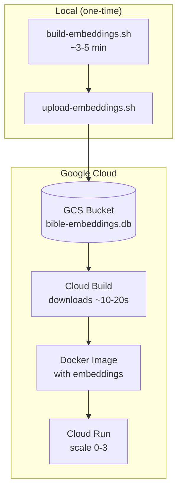

# Architecture Summary: Local-First Semantic Bible Search

This document outlines the transition of the `bible-ai` project from a Generative LLM-based agent (Gemini/OpenRouter) to a **Local-First Deep Learning Retrieval System**.

---

## 1. Vision
To build a high-performance, $0-cost, and privacy-focused Bible assistant that uses **Semantic Search** and **Re-ranking** to provide users with direct scriptural answers without the risk of AI hallucinations or external API dependencies.

## 2. Core Architecture: Two-Stage Retrieval
Instead of a single LLM call, the system now follows a two-stage pipeline:

### Stage 1: Candidate Retrieval (Bi-Encoder)
- **Model:** `langchain4j-embeddings-all-minilm-l6-v2` (ONNX).
- **Process:** Converts the user query into a vector and performs a similarity search against the `EmbeddingStore`.
- **Output:** Top 20-50 most relevant Bible verse segments.

### Stage 2: Precision Re-ranking (Cross-Encoder)
- **Model:** Local ONNX-based Scoring Model (e.g., `bge-reranker-base`).
- **Process:** Compares the user query against each of the 50 candidates simultaneously to calculate a high-precision relevance score (0.0 to 1.0).
- **Output:** Final top 3-5 verses sorted by exact contextual match.

---

## 3. Technical Stack
| Component            | Technology                                      |
|----------------------|-------------------------------------------------|
| **Framework** | Spring Boot 3.x                                 |
| **AI Orchestration** | LangChain4j                                     |
| **Inference Engine** | **ONNX Runtime** (Local CPU)                    |
| **Vector Store** | SQLite-backed `EmbeddingStore` (pre-built, ~127MB) |
| **Data Source** | Bible JSON/CSV (Pre-indexed)                    |
| **Deployment** | Google Cloud Run (scale 0-3)                    |

---

## 4. Key Implementation Logic
1. **Remove LLM Dependencies:** Delete all references to `ChatLanguageModel`, `GoogleAiGeminiChatModel`, or `OpenAiChatModel`.
2. **AI Service Transformation:**
    - Replace the `@AiService` interface with a `BibleSearchService`.
    - Instead of returning a `String` answer, return a `List<Verse>` object containing the text, reference (e.g., "Psalm 23:1"), and the relevance score.
3. **Local Logic:**
    ```java
    // Logic for the Coding AI to implement:
    1. Receive user query.
    2. EmbeddingModel.embed(query).
    3. EmbeddingStore.findRelevant(queryEmbedding, 50).
    4. (Optional) Re-rank candidates using a ScoringModel.
    5. Filter results by a minimum threshold (e.g., score > 0.6).
    6. Return formatted results to UI.
    ```

---

## 5. Benefits
- **Zero Latency:** No network calls to Gemini or OpenRouter.
- **Zero Cost:** Runs entirely on the host machine's CPU.
- **Privacy:** User queries never leave the local environment.
- **Accuracy:** Eliminates "hallucinations"; the system only returns existing Bible text.

---

## 6. Embedding & Deployment Workflow

The Bible corpus is fixed, so embeddings are pre-built once and reused across all deployments.



**Key advantages:**
- **Fast builds:** Cloud Build downloads pre-built embeddings (~10-20s) instead of generating them (~24 min)
- **Scale to zero:** Cold starts are fast (~500ms) since embeddings are baked into the image
- **Cost efficient:** No always-on instances needed; pay only for actual requests

---

### 7. Korean Language Support (Multilingual Expansion)
To support Korean, the system must use multilingual models in ONNX format:

- **Retriever Model:** `sentence-transformers/paraphrase-multilingual-MiniLM-L12-v2`
- **Reranker Model:** `BAAI/bge-reranker-v2-m3` (Multilingual)

**Implementation Detail:** The AI should use `dev.langchain4j.model.embedding.onnx.OnnxEmbeddingModel` to load the custom `.onnx` and `tokenizer.json` files for these models instead of the default English-only starters.